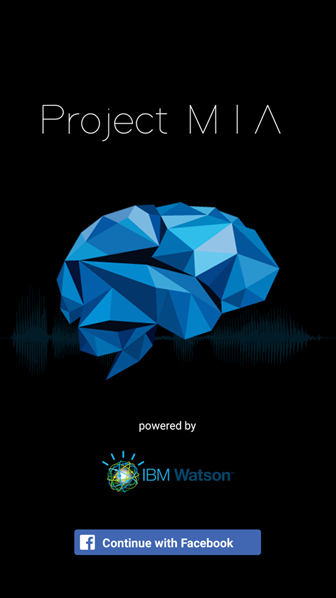
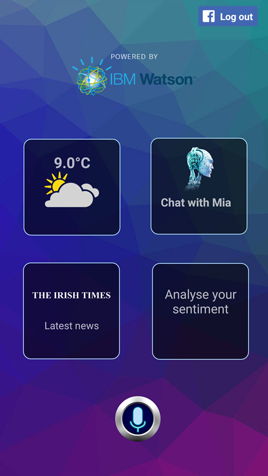

[](https://travis-ci.org/IBM-Bluemix/chatbot-watson-android)

<h1 align="center"> Poject M.I.A</h1>
<h2><p align="center"> My Intelligent Assistant powered by </p></h2>


<p align="justify">	

<b>Project M.I.A.</b> is a personal assitant based on IBM Cloud Watson technologies. The application acts as users personal assitant though which the user can communicate either verbally or textually. It offers the most current weather and also with the latest news from Google API of Irish Times. The assistant also measures and analyses user sentiment and their emotion by using Natural Language Understanding API from IBM Cloud. The analysis is gathered from user's social media feed posts.
</p>


<p align="center">





</p>

<hr>


<h3 color="red">This is project has been developed in respect to Bachelor's Degree in Computer Science in information technolgies.</h3>

The baseline of this project has been forked from ``` https://github.com/IBM-Bluemix/chatbot-watson-android.git ``` and has been then developed into this applicaiton. 

To develop a basic chatbot based on IBm Watson clone the repo and import the code in Android Studio,
`` git clone https://github.com/IBM-Bluemix/chatbot-watson-android.git ```

<hr>

<h2> Project description: </h2>
<p align="justify">	
This is a personal virtual intelligent agent. The application has been developed in conjunction with IBM Bluemix platform to act as user’s personal assistant that would help them in their daily tasks. Since this is a personal assistant it has been developed to understand user’s overall feelings, using Sentiment analysis. 
When the user logs in to the application using their social media account, their social media feed is then dragged down, parsed, converted and processed with semantic analysis. Therefore the assistant gains knowledge about the user’s social behaviour. 
</p>
<p align="center"></p>

* That's all for now, thesis with full documentation and project resources will be posted in the next few weeks * 

### Don't stop here!!! Keep coding and using Bluemix

## License

See [License.txt](https://github.com/IBM-Bluemix/chatbot-watson-android/blob/master/License.txt) for license information.
